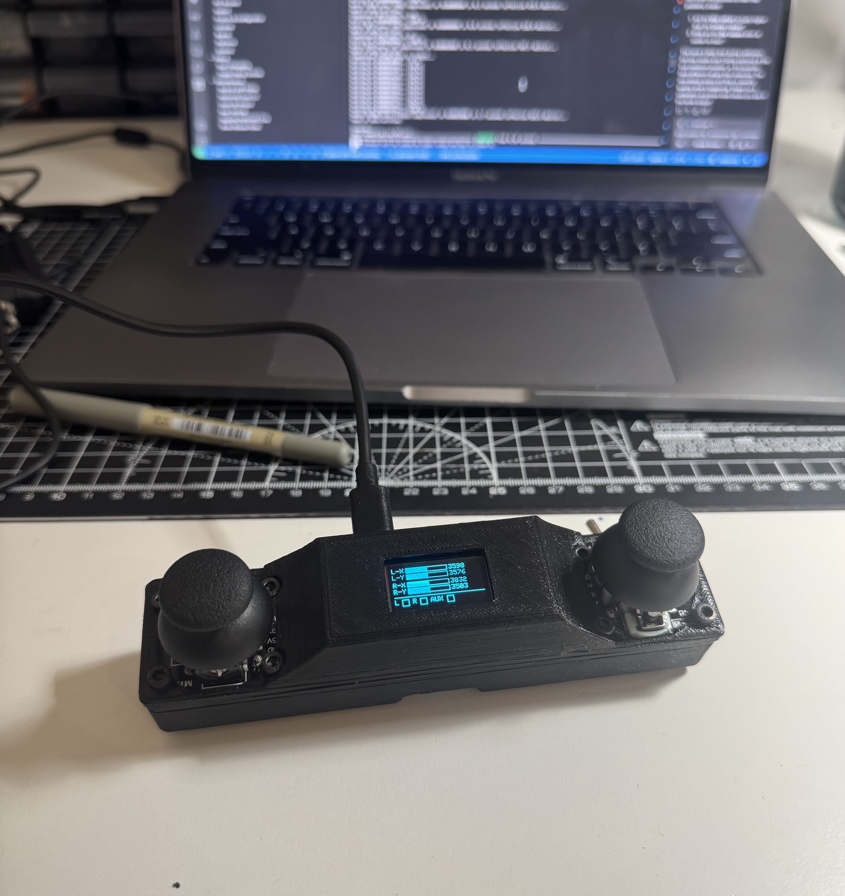
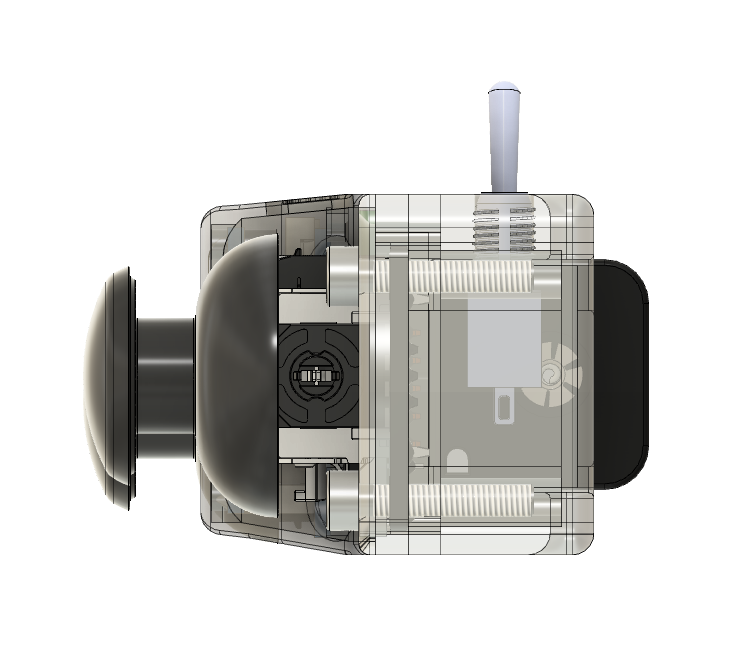
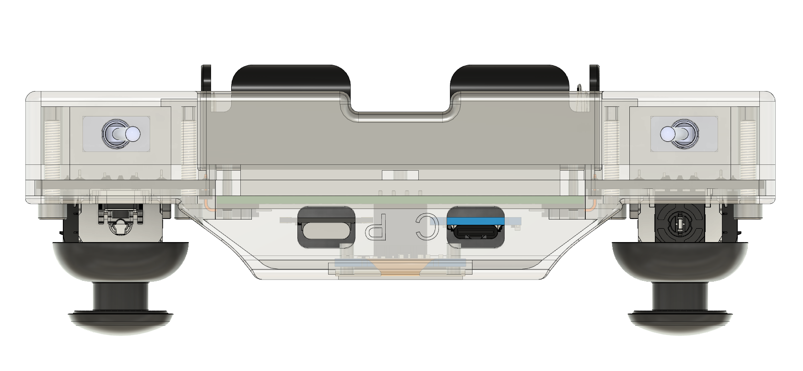
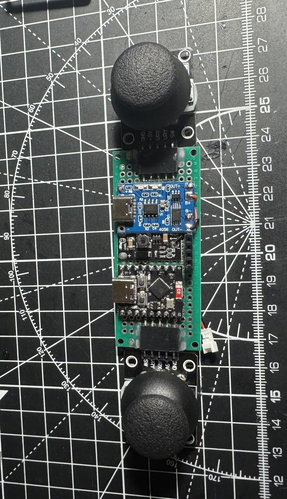
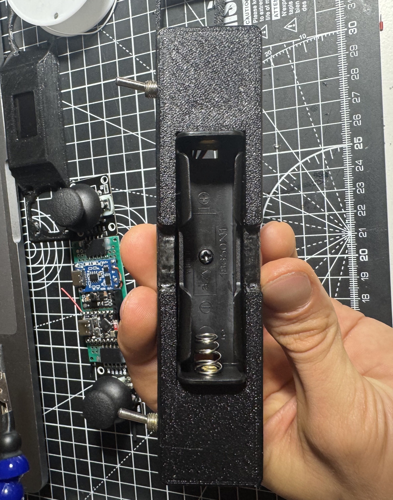
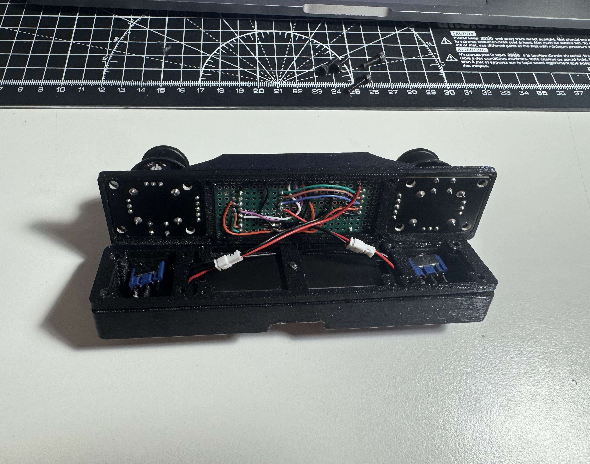

# ESP-NOW Controller



A compact, battery-powered remote controller based on the ESP32-C3 microcontroller, featuring ESP-NOW wireless communication for controlling robots and other devices. This project was completed as a 1-day build, including circuit design, 3D-printed housing, programming, and assembly.

## Features

- **ESP32-C3 Microcontroller**: Low-power, WiFi-capable microcontroller
- **ESP-NOW Communication**: Direct device-to-device wireless communication (no WiFi network required)
- **Dual Analog Joysticks**: Precise control with full-range calibration
- **OLED Display**: Real-time visual feedback with graphical bar indicators
- **18650 Battery Power**: Rechargeable lithium-ion battery with efficient power management
- **Compact Design**: Ergonomic 3D-printed housing for handheld operation
- **Calibration System**: Automated joystick calibration with persistent storage

## Hardware Components

### Controller Inputs
- **Left Joystick**: X/Y axis control (GPIO 4/3)
- **Right Joystick**: X/Y axis control (GPIO 2/1)
- **Left Button**: Digital input (GPIO 5)
- **Right Button**: Digital input (GPIO 0)
- **Aux Switch**: Additional control input (GPIO 6)

### Display & Communication
- **0.96" OLED Display**: I2C interface (GPIO 8/9)
- **ESP32-C3**: Main microcontroller with ESP-NOW capabilities
- **TP4056**: Lithium battery USBC charge board
- **Mini Voltage Step-up Module**: Battery voltage to 5v boost converter
- **18650 Battery**: 3.7V lithium-ion rechargeable battery

### Build Materials
- ESP32-C3-DevKitM-1 development board
- KY-023 analog joysticks (x2)
- 0.96" I2C OLED display
- 18650 battery holder and protection circuit
- Custom perfboard circuit
- 3D-printed housing (PETG filament)

## Software Features

### Display Interface
- Real-time graphical bar indicators for all joystick axes
- Center calibration markers
- Digital button status indicators
- Raw analog value display
- Calibration mode interface

### Calibration System
- Automated 9-step calibration process
- Persistent storage using ESP32 NVS (survives power cycles)
- Deadzone implementation for stable center position
- Range validation and error correction

### ESP-NOW Communication
- Direct peer-to-peer wireless communication
- Low latency for real-time control
- No WiFi network dependency
- Extensible for robot control applications

## Build Process

This project was completed in a single day, demonstrating rapid prototyping capabilities:

### 1. Circuit Design & Assembly
- Designed perfboard layout for ESP32-C3, joysticks, and OLED
- Soldered components and connections
- Integrated 18650 battery power system

### 2. 3D Printed Housing
- Designed ergonomic handheld enclosure
- Printed using PETG filament
- Integrated mounting points for all components

### 3. Firmware Development
- Implemented ESP32-C3 pin configuration
- Developed OLED display interface with graphics
- Created calibration system with NVS storage
- Integrated ESP-NOW communication framework

### 4. Assembly & Testing
- Mounted components in 3D-printed housing
- Performed initial calibration and testing
- Verified wireless communication capabilities

## Images

### CAD Designs
<div align="center">

| Housing Design | Internal Layout | Component Placement |
|---------------|----------------|-------------------|
|  |  |  |

| Circuit Board | Assembly View | Final Design |
|---------------|---------------|-------------|
|  |  |  |


*Complete assembly rendering*

</div>

### Build Photos
<div align="center">

| Circuit Assembly | Component Integration | Housing Assembly |
|-----------------|---------------------|------------------|
|  |  |  |

| Final Assembly | Display Interface | Complete Device |
|---------------|------------------|----------------|
|  |  |  |

</div>

## Usage

### Power On
1. Insert charged 18650 battery
2. Power on the device
3. Wait for welcome screen and automatic calibration loading

### Calibration (First Time Setup)
1. Hold both joystick buttons simultaneously for 5 seconds
2. Release buttons when prompted
3. Follow on-screen instructions:
   - Move left joystick fully up, press right button
   - Move left joystick fully down, press right button
   - Move left joystick fully left, press right button
   - Move left joystick fully right, press right button
   - Move right joystick fully up, press left button
   - Move right joystick fully down, press left button
   - Move right joystick fully left, press left button
   - Move right joystick fully right, press left button
   - Center both joysticks, press aux switch

### Normal Operation
- OLED display shows real-time joystick positions and button states
- Graphical bars indicate relative position from center
- Device is ready for ESP-NOW communication

## Technical Specifications

- **Microcontroller**: ESP32-C3 (RISC-V architecture)
- **Wireless**: ESP-NOW protocol (2.4GHz)
- **Display**: 0.96" OLED (128x64 pixels, I2C)
- **Analog Inputs**: 4x 12-bit ADC channels (0-4095 range)
- **Digital Inputs**: 3x GPIO with internal pull-ups
- **Power**: 3.7V 18650 Li-ion battery
- **Dimensions**: Custom 3D-printed enclosure (handheld)
- **Weight**: ~150g (including battery)

## ESP-NOW Integration

The controller is designed for ESP-NOW communication with robots and devices. Example implementation:

```cpp
// Send joystick data via ESP-NOW
struct ControllerData {
    int leftX, leftY, rightX, rightY;
    bool leftBtn, rightBtn, auxBtn;
};

// Broadcast to paired devices
esp_now_send(broadcastAddress, (uint8_t*)&controllerData, sizeof(controllerData));
```

## Development Environment

- **Platform**: PlatformIO with ESP32 framework
- **Libraries**:
  - Adafruit_GFX
  - Adafruit_SSD1306
  - Arduino Preferences (for NVS storage)
- **CAD Software**: Used for housing design
- **3D Printer**: FDM printer with PLA filament

## Future Enhancements

- Haptic feedback for button presses
- Additional analog inputs
- Bluetooth Low Energy support
- Customizable button mappings
- Battery level monitoring
- Extended range antennas

## License

This project is open-source. Feel free to modify and distribute.

---

*Built in one day: Circuit design, 3D printing, programming, and assembly completed within 24 hours.*
